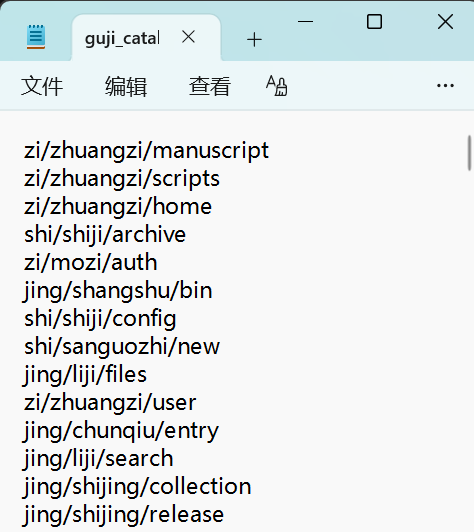
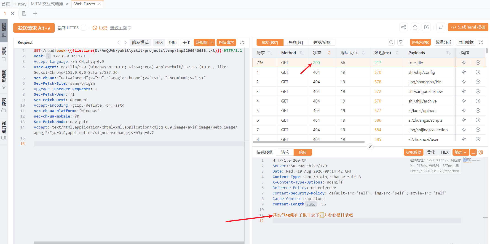
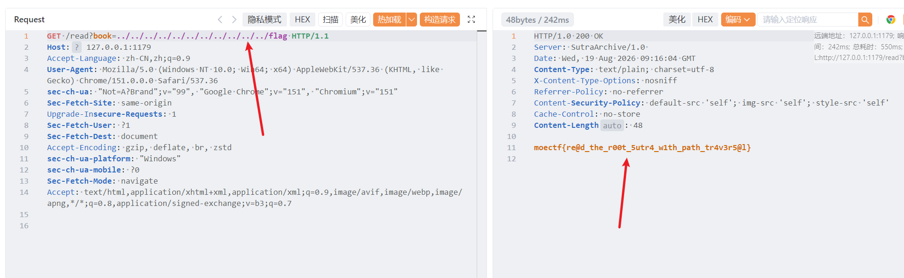

# 古籍翻阅

1. 题目来源：moectf2026
2. 题目方向：Web；知识点：目录爆破、路径穿越（../）

## 解题思路

题目描述：

> 西电自半部电台起家以来，图书馆藏书无数，出题人将flag藏在了诸多藏书之中
>
> 作为有耐心的你，一定能够逐本翻阅，获得flag的吧（确信）

题目给了一个附件，内容都是路径：

爆破一下，发现一个路径存在，说 flag 在根目录：

说根目录就尝试 `../` 路径穿越过去：

## Flag

`moectf{re@d_the_r00t_5utr4_w1th_path_tr4v3r5@l}`
