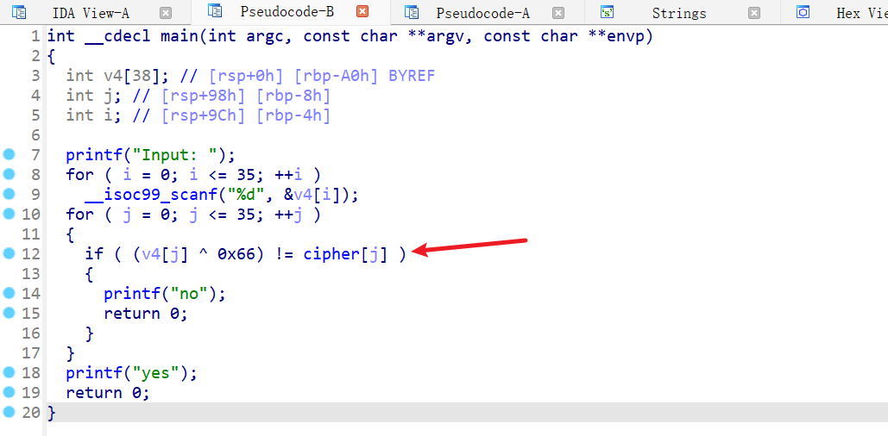
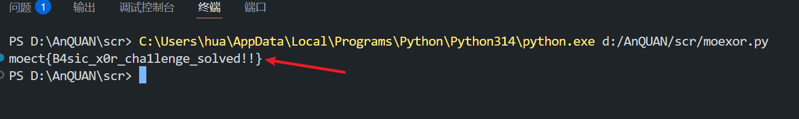

# bbxor

1. 题目来源：moectf2026
2. 题目方向：RE；知识点：异或加密逆向

## 解题思路

用 IDA 打开，查看伪代码，发现核心校验逻辑：程序读取 36 个值，逐个与 `0x66` 异或后和 `cipher` 数组比较：



输入一个字符串，每个字符与 0x66 异或后要跟 cipher 中的字符相等，写脚本：

```python
row = [11, 9, 3, 5, 18, 29, 36, 82, 21, 15, 5, 57, 30, 86, 20, 57, 5, 14, 7, 87, 10, 3, 8, 1, 3, 57, 21, 9, 10, 16, 3, 2, 71, 71, 27]

k=0x66

result=""

for i in range(len(row)):
    result+=chr(row[i]^k)
print(result)
```



## Flag

`moect{B4sic_x0r_challenge_solved!!}`

注：截图中的字符串前缀显示为 `moect{`，与 moectf 系列其他题目常见的 `moectf{` 前缀不同，可能是截图渲染误差，提交前请核对原始输出。
