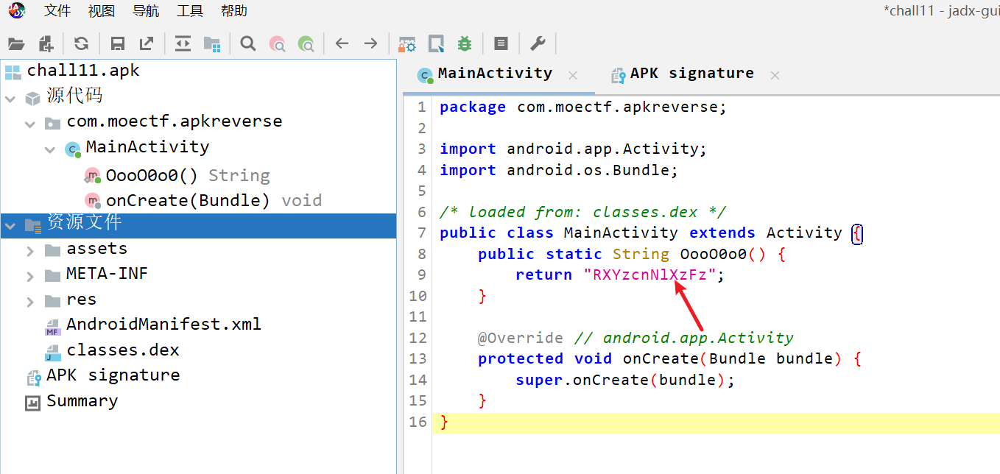
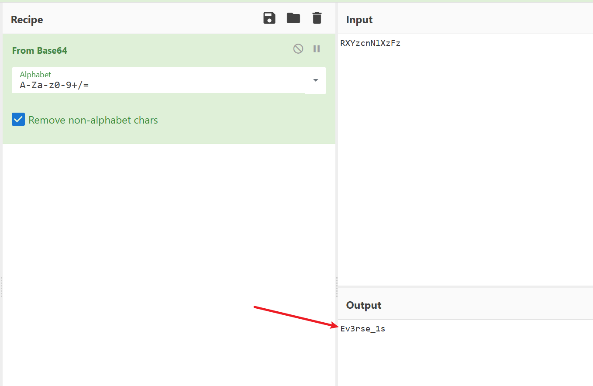
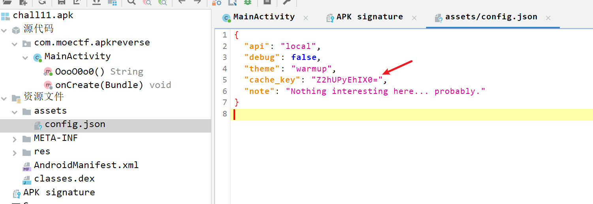
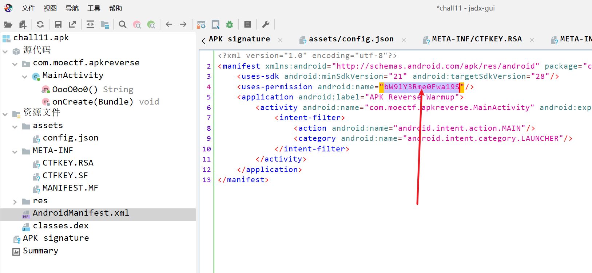
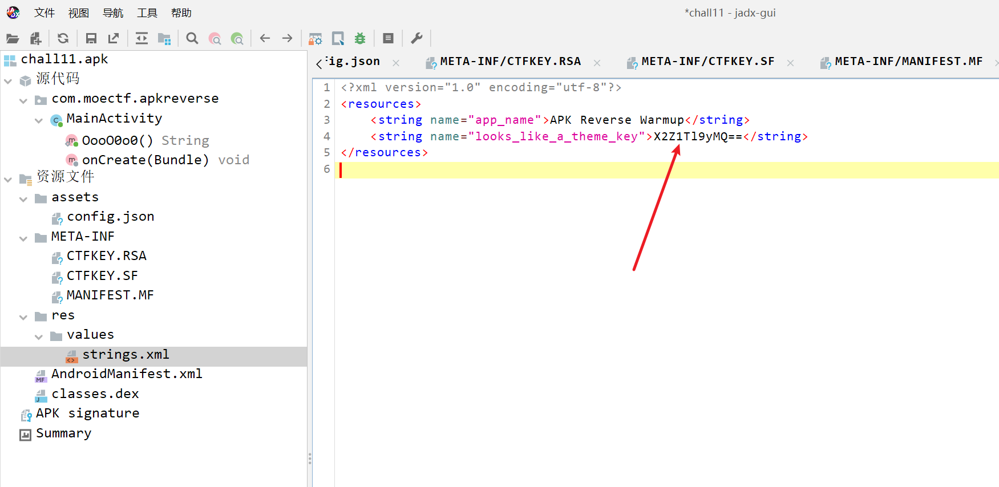

# 奇怪的APP

1. 题目来源：moectf2026
2. 题目方向：RE；知识点：安卓逆向、jadx使用、Base编码识别

## 解题思路

题目附件是 apk，拿到 jadx 里查看下：

发现源代码里有一串类似 base 的串，解一下看看：

那就继续找剩余的几部分：

一共四部分，组合下就是 flag：

## Flag

`moectf{Apk_REv3rse_1s_fuN_r1ghT?!!!}`
