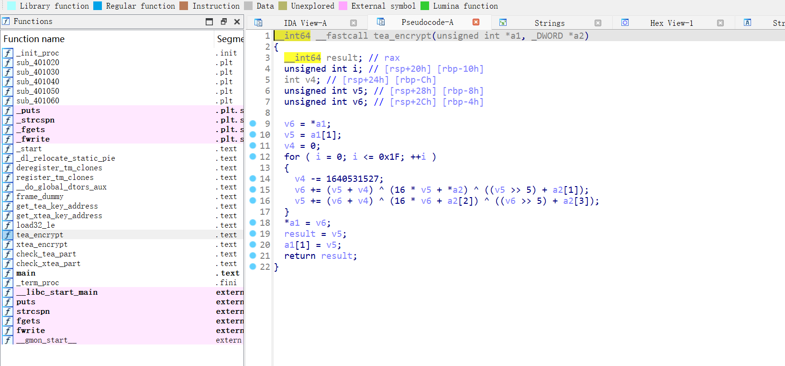
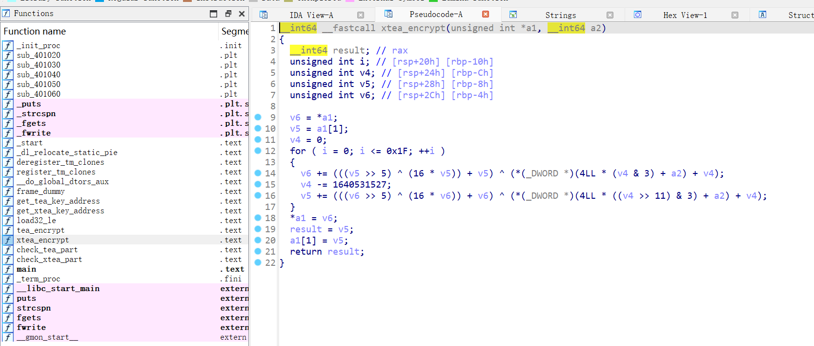
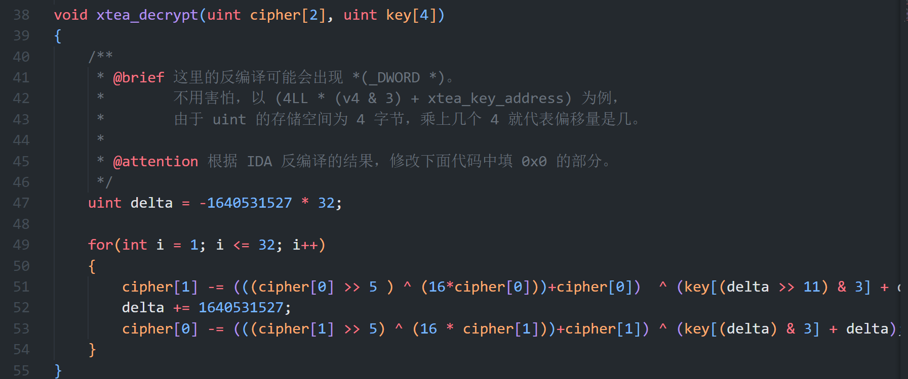
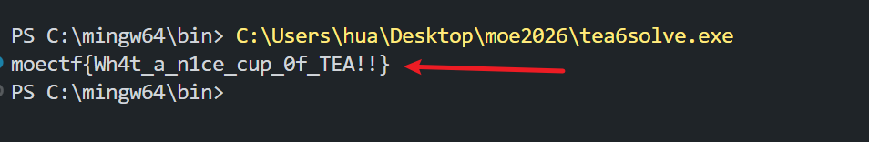

# 请你喝茶

1. 题目来源：moectf2026
2. 题目方向：RE；知识点：TEA/XTEA加密算法逆向、小端序存储

## 解题思路

题目描述：

> fanchai 请你喝茶！请根据对 chall6 的逆向分析结果，完善 tea6solve.c 解密脚本。


题目给了两个附件，其中 chall6 可用 IDA 查看 TEA 和 XTEA 的加密逻辑，根据对 chall6 的逆向分析，来补充 tea6solve.c 里面解密部分的代码和部分 key 信息。

TEA 加密逻辑如下：



补充解密代码如下：

```c
void tea_decrypt(uint cipher[2], uint key[4])
{

    uint delta = -1640531527 * 32;

    for(int i = 1; i <= 32; i++)
    {
        cipher[1] -= (cipher[0] + delta) ^ (16 * cipher[0] + key[2]) ^ ((cipher[0] >> 5) + key[3]);
        cipher[0] -= (cipher[1] + delta) ^ (16 * cipher[1] + key[0]) ^ ((cipher[1] >> 5) + key[1]);
        delta += 1640531527;
    }
}
```

XTEA 部分加密逻辑如下：



补充 c 中部分解密代码如下：



其中 key 的补充涉及到了一个小端序问题：

x86-64 机器一般用小端序存储，简单说就是低位字节存储在低地址，高位字节存储到高地址，方便机器运算。

## Flag

将 c 程序补充完毕后，运行即可得到 flag：



`moectf{Wh4t_a_n1ce_cup_0f_TEA!!}`
