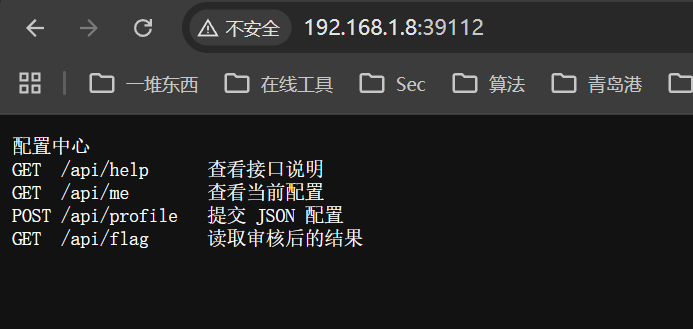
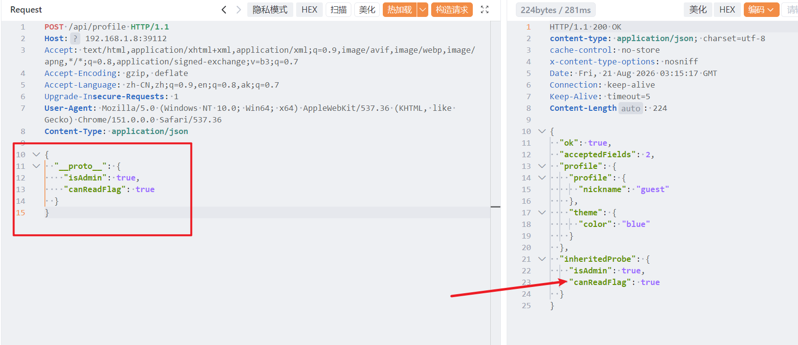
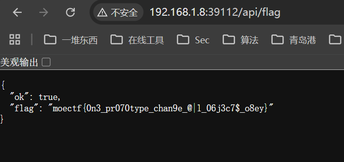

# 合乎周礼


1. 题目来源：moectf2026
2. 题目方向：Web；知识点：JS原型链污染

## 解题思路

```python
我听说，自古以来，父亲管教儿子，讲的是长幼有序、本分分明；儿子若有过错，父亲理应指出，这是家中应有的礼数。如今我写代码，就像在搭建一座小庭院：

JavaScript是庭院中的规矩与路数，而“父亲管教儿子”这句老话，拿来比作编程里的继承与约束，倒也有几分道理。父亲要儿子行得正、走得直，代码里的父类也要让子类守好本分、不逾矩。这样看来，我在JavaScript里讲这个道理，难道不也是合情合理的吗？
```


访问`/api/help`，得知需要满足条件：`isAdmin=true`且`canReadFlag=true`时才能获取FLAG。

访问`/api/me`，查看当前配置：

```
{
  "ok": true,
  "profile": {
    "profile": { "nickname": "guest" },
    "theme": { "color": "blue" },
    "isAdmin": true,
    "canReadFlag": true,
    "inheritedProbe": { "isAdmin": true, "canReadFlag": true }
  },
  "inheritedProbe": { "isAdmin": null, "canReadFlag": null }
}
```

`inheritedProbe`字段显示继承属性为null

这个题利用了JavaScript的原型链继承机制。当访问对象的属性时，如果对象本身没有该属性，会沿着原型链向上查找。然后题目说了`POST /api/profile   提交 JSON 配置`

构造请求包如下，这个包发出后，就成功继承了其原型的两个属性，污染成功



## Flag


