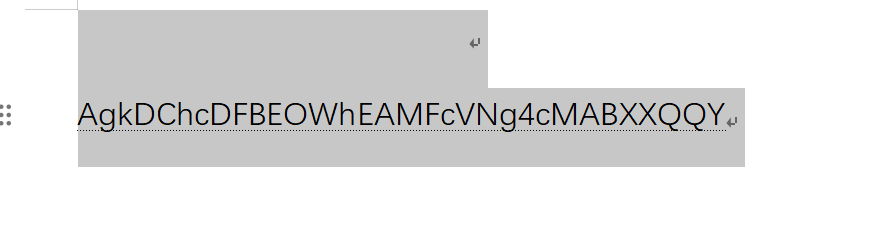
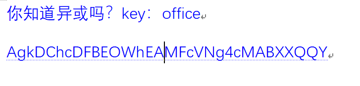

# 空白文档


1. 题目来源：moectf2026
2. 题目方向：Misc；知识点：Word隐写+异或

## 解题思路



题目给了一个word，全选一下发现有白色没显示的字体，换个颜色看下



看起来就是需要异或了，脚本如下

```python
import base64

cipher = "AgkDChcDFBEOWhEAMFcVNg4cMABXXQQY"
key = "office"     
result=""

for i in range(len(cipher)):
    result+=chr(ord(cipher[i])^ord(key[i % len(key)]))

print(result)
```

输出乱码了····

再看一下这串字符串，大小写数字都有，尝试先base64解一下

```python
import base64

cipher = "AgkDChcDFBEOWhEAMFcVNg4cMABXXQQY"
data = base64.b64decode(cipher)
key = "office"     
result=""

for i in range(len(data)):
    result+=chr(data[i]^ord(key[i % len(key)]))

print(result)
```


## Flag

`moectf{wh3re_1s_my_f14g}`
